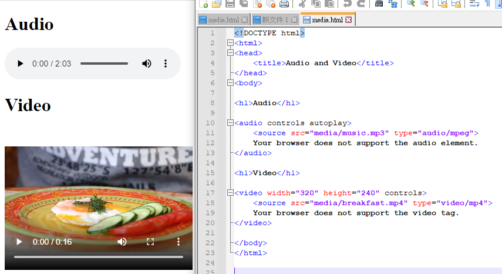
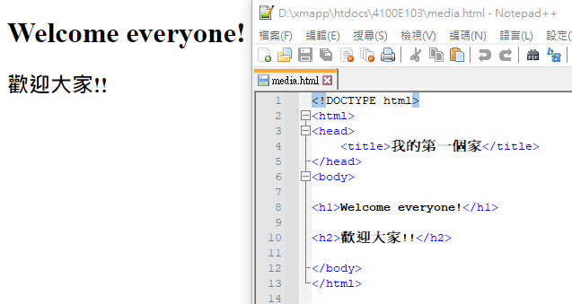

# xampp網站建置

## xampp
- XAMPP是最流行的PHP開發環境
- XAMPP是完全免費且易於安裝的Apache發行版本，其中包含MariaDB、PHP和Perl。XAMPP開放源碼套件的設置讓安裝和使用出奇容易。
  - 網站伺服器(web server) ==> Apache
  - 資料庫伺服器(database server) ==> MariaDB
  - 伺服器程式開發engine  ==> PHP

## xampp目錄結構

- 網站程式放在  D:\xampp\htdocs
- 你自己開發的網站 D:\xampp\htdocs\4100E103
  - 第一個網頁 D:\xampp\htdocs\4100E103\index.html

```
user@DESKTOP-L8P5QSQ d:\xmapp
# dir *.exe
 磁碟區 D 中的磁碟沒有標籤。
 磁碟區序號:  BA86-5E68

 d:\xmapp 的目錄

2013/03/30  下午 08:29            60,928 service.exe
2021/10/07  下午 02:56        12,521,156 uninstall.exe
2021/04/06  下午 07:38         3,368,448 xampp-control.exe
2013/03/30  下午 08:29           118,784 xampp_start.exe
2013/03/30  下午 08:29           118,784 xampp_stop.exe
               5 個檔案      16,188,100 位元組
               0 個目錄  979,203,117,056 位元組可用

user@DESKTOP-L8P5QSQ d:\xmapp
#
```
## 課本補充範例
```
<!DOCTYPE html>
<html>


<head>
    <title>Audio and Video</title>
</head>


<body>

<h1>Audio</h1>

<audio controls autoplay>
    <source src="media/music.mp3" type="audio/mpeg">
    Your browser does not support the audio element.
</audio>

<h1>Video</h1>

<video width="320" height="240" controls>
    <source src="media/breakfast.mp4" type="video/mp4">
    Your browser does not support the video tag.
</video>

</body>
</html>
```



## 我的第一支程式
```html
<!DOCTYPE html>
<html>
<head>
    <title>我的第一個家</title>
</head>
<body>

<h1>Welcome everyone!</h1>

<h2>歡迎大家!!</h2>

</body>
</html>
```

